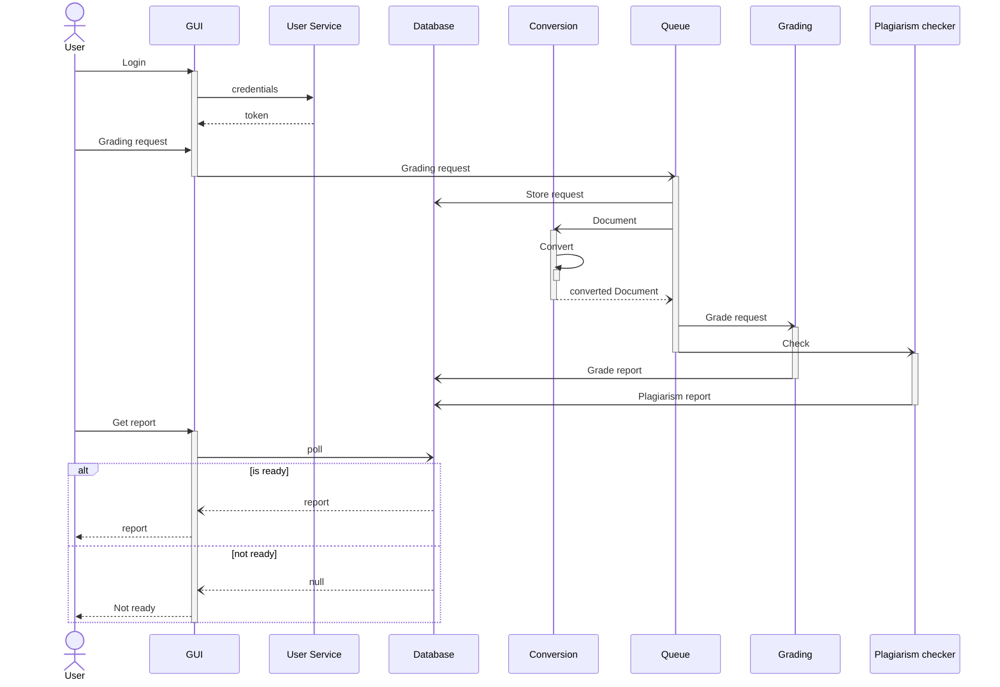

# Architecture Overview

## Introduction

The LLM Grading System is designed to automate the assessment of student reports using advanced language models. The system evaluates the quality of content and compliance with project guidelines, providing an objective and precise tool to support the educational process.

## System Components

### Conversion

The conversion service is responsible for converting the user-submitted document to the common text-based format, 
for further processing.

#### Supported formats
The conversion service should be able to accept any of the following formats:
- Plain text (`.txt`)
- Microsoft Word Document (`.doc` and `.docx`)
- LaTeX (`.tex`)
- PDF (`.pdf`)

#### Potential issues:
- Tables in the PDF and Word are not easily parsable by LLMs. 
There should be a uniform style that the tables will be converted to (e.g. markdown-style tables)
- Equations should be converted to TeX format

### Grading

The Grading module evaluates the content quality and compliance with guidelines using pre-trained language models.
The input to the grading module are the grading criteria defined by the teacher and the student's report.
The service uses a LLM to evaluate the report in context of the defined requirements.

The context window of the LLM will probably not be big enough to contain the entire report, therefore, 
this service should contain an additional vector database (probably qdrant) for the purposes of context retrieval.
>Note that the emphasis should be put on ensuring that the data does not get mixed up 
if 2 or more reports are being graded at the same time.

### User service

The user service should authenticate user's credentials and manage data related to particular user.
Using this service, the user should be able to authenticate with the system, 
submit grading requests, and view the results, if they are available.

### GUI

The GUI module provides a graphical user interface for interaction with the User service.

## Data Flow

