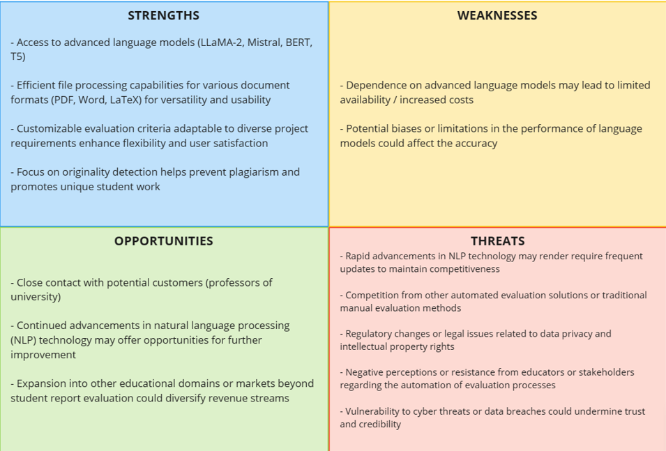
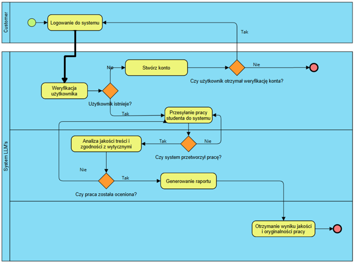
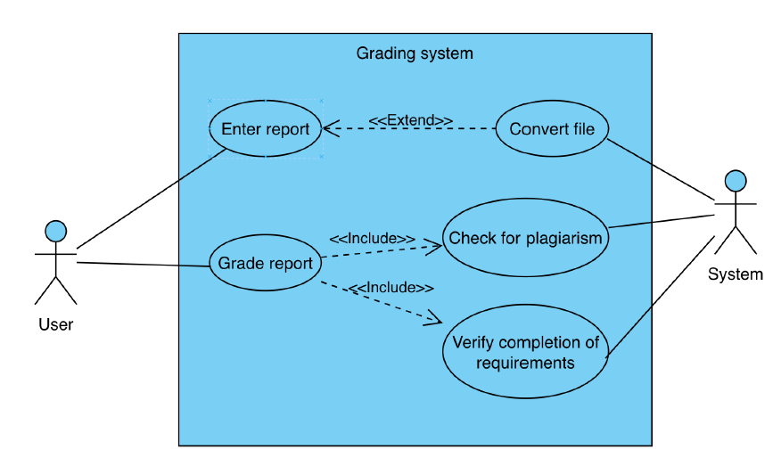
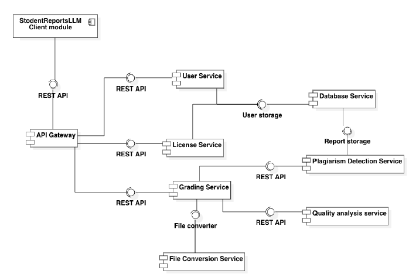

# Dokumentacja Projektowa - StudentReportLLMs

## Cel projektu

Celem projektu jest stworzenie systemu wykorzystującego zaawansowane modele językowe do automatycznej oceny sprawozdań
studenckich.
System ma na celu analizę jakości treści oraz ocenę zgodności z wytycznymi projektowymi, zapewniając obiektywne i
precyzyjne narzędzie wspomagające proces edukacyjny.

## Zespół projektowy

- Magdalena Pakuła
- Jakub Pawlak
- Piotr Hynasiński
- Artur Pietrzak
- Rafał Górniak

## Definicje

| Termin                                  | Definicja                                                                                                                                                                                                                                                                                                                                  |
|-----------------------------------------|--------------------------------------------------------------------------------------------------------------------------------------------------------------------------------------------------------------------------------------------------------------------------------------------------------------------------------------------|
| LLM                                     | Zaawansowane modele jezykowe, takie jak GPT-4, BERT, T5, wykorzystywane do analizy i generowania tekstu.                                                                                                                                                                                                                                   |
| Ocena jakości treści                    | Proces analizy sprawozdań pod katem poprawności jezykowej, spójności oraz klarowności przekazywanych informacji.                                                                                                                                                                                                                           |
| Ocena zgodności z wytycznymi            | Proces sprawdzania, czy sprawozdanie spelnia określone wymagania projektowe.                                                                                                                                                                                                                                                               |
| Interfejs użytkownika (UI)              | Platforma webowa umożliwiajaca interakcje z systemem przez studentów i nauczycieli.                                                                                                                                                                                                                                                        |
| Information Retrieval                   | Proces wyszukiwania informacji w dużych zbiorach danych, który w projekcie bedzie wspierany przez bazy danych i technologie zarządzania wektorami.                                                                                                                                                                                         |
| Automatyzacja                           | Automatyzacja odnosi sie do procesu zastepowania lub uzupelniania zadań wykonywanych przez ludzi zadaniami wykonywanymi przez maszyny lub programy komputerowe. Celem automatyzacji jest zwiekszenie wydajności, obniżenie kosztów i minimalizacja bledo ́w poprzez eliminacje ludzkiego udzialu lub zautomatyzowanie powtarzalnych zadań. |
| Tokenizacja                             | Proces podzialu tekstu na mniejsze jednostki, zwane tokenami, co jest czesto używane w przetwarzaniu jezyka naturalnego, aby lepiej zrozumieć i analizować zawartość tekstu.                                                                                                                                                               |
| OCR (Optical Character Recognition)     | Technologia pozwalajaca na konwersje obrazów lub zeskanowanych dokumentów na edytowalny tekst, co jest istotne dla odczytu i analizy zawartości plików PDF.                                                                                                                                                                                |
| Skalowalność systemu                    | Skalowalność systemu odnosi sie do zdolności systemu do efektywnego dostosowywania sie do wzrostu obciażenia lub zasobów. System jest uznawany za skalowalny, jeśli może rosnać lub kurczyć sie w zależności od potrzeb, zachowujac przy tym swoja wydajność, niezawodność i funkcjonalność.                                               |
| API (Application Programming Interface) | Interfejs programowania aplikacji, który umożliwia komunikacje miedzy różnymi komponentami oprogramowania, na przyklad miedzy systemem automatyzacji oceny a silnikami modeli jezykowych.                                                                                                                                                  |
| System odczytu plików                   | System zdolny do przetwarzania plików w formatach PDF, Word, LaTeX w celu analizy ich treści przez modele jezykowe.                                                                                                                                                                                                                        | 

## Opis potrzeby

Głównym założeniem, a zarazem potrzebą jest wiarygodne, dokładne oraz z jak najmniejszym błędem sprawdzanie prac
naukowych napisanych przez usługobiorców akademii, czyli studentów przy pomocy określonego narzędzia.
Przy danych z góry kryteriach, program ma zachowywać się w należyty sposób.
Potrzeba zaistniała ze względu na możliwą stronniczość wykładowcy.
Oznacza to, że osoby, które chodziły na wykłady, krewni bądź znajomi, osoby faworyzowane przez różne względy mogłyby być
oceniane wyżej w porównaniu do reszty, za taką samą pracę.

Następnym możliwym zagrożeniem jest błąd ludzki. W danej chwili, przy braku stu-procentowej pewności osoba sprawdzająca
może niesłusznie odjąć punkty, podczas gdy rozwiązania, fraza zaproponowana przez studenta jest zupełnie poprawna i vice
versa.
Następną coraz większą “plagą” jest plagiat oraz paragrafy generowane przez sztuczną inteligencję.
To również powinno być rozróżnione oraz wyłapane. Dlatego więc, aby każdy uczeń był równy wobec systemu sprawdzania,
potrzebna jest technika, program to zapewniający.
Ponadto każde konto uczelniane powinno mieć dostęp do tego rozwiązania, a zatem potrzebna jest autentykacja użytkownika
dla studenta oraz nauczyciela, jako pośredniego administratora narzędzia.

## Zidentyfikowani odbiorcy

| Nazwa                              | Opis                                                                                                                                                                                                                                                                  |
|------------------------------------|-----------------------------------------------------------------------------------------------------------------------------------------------------------------------------------------------------------------------------------------------------------------------|
| Wykładowca (Nauczyciel akademicki) | Osoba pracująca w systemie oświaty w sektorze publicznym lub prywatnym w zależności od rodzaju miejsca pracy. Jednym z obowiązków zadawanie, a w konsekwencji sprawdzanie prac pisemnych, napisanych przez klientów uczelni lub kadry akademickiej w roli recenzenta. |
| Student (Uczeń)                    | Osoba realizująca ofertę uczelni, na której się znajduje w charakterze usługobiorcy. Pisze zadany przez nauczyciela raport, a następnie według kryteriów oceniania dostaje należytą informację zwrotną w postaci oceny.                                               |

## Analiza SWOT

# Zakres pojektu

## Zakres funkcjonalny

System ma wykorzystywać duże modele językowe do oceny sprawozdań studenckich.
Ocena ma dotyczyć dwóch kluczowych aspektów: jakości treści i zgodności z wytycznymi projektowymi (konkretnego zadania,
którego dotyczy sprawozdanie)

Wymagane będzie zintegrowanie i wykorzystanie zaawansowanych modeli językowych, bez konieczności ich dodatkowego
szkolenia (fine-tuning).

Projekt powinien obejmować funkcjonalność odczytu i analizy plików w formatach PDF, Word, LaTeX. Dodatkowo, system musi
umożliwiać definiowanie przez operatora specyficznych kryteriów oceny, adaptowalnych do różnorodnych wymagań
projektowych.

Projekt zakłada również opracowanie metody oceny oryginalności tekstu, aby zapobiegać plagiatom i promować unikalność
prac studenckich.

## Zakres niefunkcnojalny

Ważnym elementem będzie stworzenie intuicyjnego interfejsu użytkownika, który pozwoli na łatwe formułowanie zapytań
dotyczących specyficznych kryteriów oceny dla ogółu dostępnych prac, takich jak często popełniane błędy czy powtarzające
się braki w sprawozdaniach.

Kluczowymi elementami będą efektywność, precyzja oraz użyteczność systemu.

Ważne będzie również stworzenie szczegółowej dokumentacji projektowej.

# Wymagania

## Wymagania funkcjonalne

1. Zarządzanie kontami użytkowników
    1. Tworzenie nowych kont
    2. Modyfikacja przywilejów istniejących kont
2. Formułowaie przez nauczyciela kryteriów oceny pracy
3. Analiza jakościowa treści sprawozdania
4. Analiza zgodności z wymaganiami treści sprawozdania
5. Porównanie pod kątem plagiatu z historycznymi pracami zapisanymi w uczelnianym archiwum
6. Odczyt różnych formatów plików (.docx, .pdf, .tex)
7. Zabezpieczenie przed atakami typu *prompt injection*

## Wymagania niefunkcnojalne

1. Intuicyjność i reaktywność interfejsu użytkownika
2. Wysokie wartości miar porównujących wyniki automatycznego oraz manualnego sprawdzania:
    1. F1-score
    2. Precision
    3. Recall
    4. Accuracy
3. Pozytywna korelacja pomiędzy wynikami automatycznego i manualnego sprawdzania
4. Automatyczne testy poprawności działania systemu
5. Szczegółowa dokumentacja projektowa
6. Satysfakcjonujący czas weryfikacji pracy przez system

# Projekt systemu

## Przepływ danych

## Proeces biznesowy

## Przypadki użycia

## Architektura systemu

### Opis ogólny

Architektura systemu oparta jest na mikroserwisach, co umożliwia łatwą skalowalność i niezależność poszczególnych
komponentów.
Główne komponenty architektoniczne to:

- **Frontend:** Interfejs użytkownika (UI), dostępny jako aplikacja webowa umożliwiająca studentom przesyłanie swoich
  sprawozdań oraz przeglądanie ocen.
- **Backend:** Centralny serwis zarządzający, który obsługuje logikę biznesową, integrację z modelami językowymi oraz
  zarządzanie zadaniami oceny.
- **Serwisy modeli językowych:** Oddzielne serwisy odpowiedzialne za integrację z różnymi modelami językowymi (np.
  GPT-4, BERT), które wykonują analizę i ocenę tekstu.
- **Baza danych:** Centralna baza danych przechowująca skonwertowane sprawozdania oraz baza dancyh do analizy i
  przetwarzania sprawozdań.
- **System odczytu i analizy plików:** Serwis do przetwarzania plików w formatach PDF, Word, LaTeX, konwertujący je na
  tekst, który jest następnie przekazywany do serwisów modeli językowych.

### Komponenty systemu

## Technologie i narzędzia

Do realizacji projektu wykorzystano szereg nowoczesnych technologii i narzędzi:

- **Frontend:** React.js
- **Backend:** Node.js, Python (do integracji z modelami językowymi)
- **Baza danych:** MongoDB, QDRANT
- **Serwisy modeli językowych:** Python, TensorFlow, Hugging Face Transformers
- **System kontroli wersji:** Git, GitHub
- **Konteneryzacja:** Docker
- **Zarządzanie zadaniami:** RabbitMQ

## Bezpieczeństwo

Bezpieczeństwo systemu zapewniono poprzez:

- Uwierzytelnianie i autoryzację użytkowników przy użyciu *JWT (JSON Web Token)*.
- Zabezpieczenia API przed atakami typu *SQL injection* oraz *cross-site scripting (XSS)*.
- Szyfrowanie danych przechowywanych w bazie danych oraz w transmisji między serwisami.

Podjęto także środki ostrożności, aby zapewnić zgodność z przepisami o ochronie danych osobowych (GDPR).

## Interfejs użytkownika

Projekt interfejsu użytkownika (UI) systemu *StudentReportLLMs* ma na celu zapewnienie intuicyjnej, efektywnej i
przyjaznej dla użytkownika platformy, umożliwiającej łatwą interakcję studentów oraz nauczycieli z systemem
automatycznej oceny sprawozdań studenckich. Interfejs powinien być dostosowany do potrzeb różnych użytkowników,
zapewniając transparentność oceniania oraz dostęp do szczegółowych informacji na temat wyników i zaleceń.

### Założenia projektowe

Główne założenia projektowe interfejsu użytkownika obejmują:

- **Prostota obsługi:** Interfejs powinien być intuicyjny i łatwy w nawigacji, co umożliwi szybkie i efektywne
  korzystanie zarówno studentom, jak i nauczycielom.
- **Responsywność:** Interfejs powinien być responsywny, dostosowując się automatycznie do różnych urządzeń (komputery,
  tablety, telefony), co zapewni pełen dostęp do funkcjonalności systemu niezależnie od używanego urządzenia.
- **Personalizacja:** System powinien umożliwiać personalizację doświadczenia użytkownika, na przykład poprzez
  dostosowanie preferencji wyświetlania danych lub ustawień powiadomień.
- **Bezpieczeństwo:** Interfejs powinien zapewniać wysoki poziom bezpieczeństwa danych osobowych i wyników oceniania,
  zgodnie z obowiązującymi przepisami o ochronie danych.
- **Wizualizacja danych:** System powinien oferować czytelne i przejrzyste prezentowanie wyników oceniania, statystyk
  oraz raportów, aby użytkownicy mogli łatwo analizować i interpretować zgromadzone dane.

### Elementy interfejsu

Interfejs użytkownika systemu będzie zawierać następujące kluczowe elementy:

- **Panel logowania:** Dedykowany dla studentów i nauczycieli, umożliwiający autentykację i dostęp do odpowiednich
  funkcji systemu.
- **Panel administracyjny:** Dla administratorów systemu, zapewniający zarządzanie użytkownikami, ustawieniami systemu
  oraz raportami.
- **Formularz wysyłania sprawozdań:** Umożliwiający studentom przesyłanie swoich prac w różnych formatach (PDF, Word,
  LaTeX).
- **Wyświetlanie wyników:** Interaktywne wyświetlanie wyników oceniania, z możliwością szczegółowego przeglądu
  komentarzy i zaleceń.
- **Panel konfiguracyjny kryteriów oceny:** Dla nauczycieli, umożliwiający definiowanie specyficznych kryteriów
  oceniania dostosowanych do wymagań projektowych.
- **Powiadomienia:** System powinien obsługiwać powiadomienia w czasie rzeczywistym, informujące o statusie ocen,
  komunikatach od nauczycieli oraz innych istotnych wydarzeniach.

Projekt interfejsu będzie stale ewoluował na podstawie feedbacku użytkowników oraz zmieniających się potrzeb
edukacyjnych, zapewniając wysoką użyteczność i satysfakcję z jego użytkowania.

# Tesowanie

Testowanie systemu odgrywa kluczową rolę w zapewnieniu jego niezawodności, funkcjonalności oraz zgodności z wymaganiami.
Proces testowania obejmuje szeroki zakres działań mających na celu sprawdzenie każdego aspektu systemu, zarówno pod
kątem jego działania technicznego, jak i użyteczności.

## Cele testowania

Główne cele testowania systemu obejmują:

- **Weryfikacja poprawności funkcjonalnej:** Testowanie ma na celu sprawdzenie, czy wszystkie funkcjonalności systemu
  działają zgodnie z założeniami i spełniają oczekiwania użytkowników.
- **Ocena wydajności:** Testy wydajnościowe pomagają określić, jak system radzi sobie z różnym obciążeniem, zapewniając
  odpowiednią reaktywność i szybkość działania.
- **Bezpieczeństwo:** Testowanie bezpieczeństwa ma na celu zidentyfikowanie potencjalnych luk oraz zagrożeń związanych z
  dostępem do danych osobowych i bezpieczeństwem systemu jako całości.
- **Testy integracyjne:** Sprawdzają, czy poszczególne komponenty systemu współpracują ze sobą zgodnie z założeniami
  projektowymi, zapewniając pełną funkcjonalność.
- **Testy użyteczności:** Ocena interfejsu użytkownika pod kątem intuicyjności, łatwości obsługi oraz zgodności z
  oczekiwaniami użytkowników końcowych.
- **Testy wydajności modeli językowych:** Sprawdzenie, czy zastosowane duże modele językowe działają zgodnie z
  oczekiwaniami pod względem generacji tekstu, analizy treści i oceny oryginalności.

## Metodologia testowania

Proces testowania systemu będzie oparty na zintegrowanych metodologiach testowych, obejmujących:

- **Testy jednostkowe:** Sprawdzenie poprawności działania poszczególnych komponentów systemu oraz ich izolowanych
  funkcji.
- **Testy integracyjne:** Weryfikacja współpracy różnych komponentów systemu i ich interakcji, aby zapewnić spójność i
  pełną funkcjonalność systemu.
- **Testy akceptacyjne:** Przeprowadzenie testów z udziałem użytkowników końcowych, aby ocenić, czy system spełnia ich
  oczekiwania oraz czy jest łatwy w użyciu.
- **Testy wydajnościowe:** Ocena wydajności systemu pod względem czasu odpowiedzi, obciążenia i stabilności działania w
  różnych warunkach.
- **Testy bezpieczeństwa:** Weryfikacja odporności systemu na ataki typu \textit{SQL injection}, \textit{cross-site
  scripting} oraz inne potencjalne zagrożenia.

## Plan testów

Plan testów obejmuje szczegółowe scenariusze testowe dla każdej funkcjonalności systemu, uwzględniając różne przypadki
użycia, typowe błędy użytkowników oraz nieoczekiwane sytuacje. Każdy test będzie dokumentowany, a wyniki będą
analizowane i raportowane, co umożliwi identyfikację i szybkie rozwiązywanie napotkanych problemów.

1. **Sprawdzenie czasu przetwarzania sprawozdań studenckich przez model językowy**
    - **Opis przypadku testowego:** Czas przetwarzania sprawozdań studenckich nie powinien przekraczać 15-20 sekund.
    - **Kroki potrzebne do przeprowadzenia testu:**
        1. Przesłanie sprawozdania studenckiego do systemu i oczekiwanie na przetworzenie.
        2. Rozpoczęcie przetwarzania sprawozdania studenckiego przez model językowy oraz rozpoczęcie odmierzania czasu.
        3. Weryfikacja czy czas przetwarzania jest akceptowalny.
    - **Oczekiwane rezultaty:** System przetwarza sprawozdanie studenckie w akceptowalnym czasie.

2. **Sprawdzenie czy system poprawnie analizuje jakość treści sprawozdania**
    - **Opis przypadku testowego:** Jakość treści jest analizowana, a system generuje raport końcowy.
    - **Kroki potrzebne do przeprowadzenia testu:**
        1. Przesłanie sprawozdania studenckiego do analizy jakości treści.
        2. Uruchomienie funkcji analizy jakości treści.
        3. Sprawdzenie wygenerowanego raportu oceny jakości.
    - **Oczekiwane rezultaty:** System prawidłowo analizuje jakość treści sprawozdania i generuje raport po zakończeniu
      procesu.

3. **Sprawdzenie czy system poprawnie ocenia zgodność z wytycznymi projektowymi**
    - **Opis przypadku testowego** Zgodność sprawozdania z wytycznymi jest oceniana.
    - **Kroki potrzebne do przeprowadzenia testu:**
        1. Przesłanie sprawozdania studenckiego do oceny zgodności z wytycznymi.
        2. Zdefiniowanie specyficznych kryteriów oceny zgodnie z wytycznymi projektowymi.
        3. Uruchomienie funkcji oceny zgodności z wytycznymi.
        4. Sprawdzenie wyników działania funkcji względem wytycznych.
    - **Oczekiwane rezultaty:** System prawidłowo ocenia zgodność sprawozdania z wytycznymi projektowymi.

4. **Sprawdzenie funkcji oceny oryginalności tekstu**
    - **Opis przypadku testowego** Wykrywanie plagiatu.
    - **Kroki potrzebne do przeprowadzenia testu:**
        1. Przesłanie sprawozdania studenckiego podejrzanego o plagiat.
        2. Uruchomienie funkcji oceny oryginalności tekstu.
        3. Sprawdzenie raportu oryginalności.
    - **Oczekiwane rezultaty:** System identyfikuje zduplikowane fragmenty i generuje wynik oceny oryginalności.

5. **Sprawdzenie kompatybilności systemu z różnymi formatami plików**
    - **Opis przypadku testowego** Kompatybilność z formatami plików PDF, Word, LaTeX - rezultaty powinny być te same
      dla każdego formatu.
    - **Kroki potrzebne do przeprowadzenia testu:**
        1. Przesłanie sprawozdań studenckich w formatach PDF, Word i LaTeX.
        2. Uruchomienie funkcji analizy jakości i oceny zgodności dla każdego formatu pliku.
        3. Porównanie wyników dla każdego formatu.
    - **Oczekiwane rezultaty:** System poprawnie odczytuje i przetwarza sprawozdania we wszystkich obsługiwanych
      formatach.

6. **Testowanie interfejsu użytkownika pod kątem łatwości użytkowania**
    - **Opis przypadku testowego** Intuicyjny interfejs użytkownika.
    - **Kroki potrzebne do przeprowadzenia testu:**
        1. Nawigacja po interfejsie użytkownika w celu uzyskania dostępu do różnych funkcji.
        2. Formułowanie zapytań oceny za pomocą dostępnego interfejsu.
    - **Oczekiwane rezultaty:** Interfejs użytkownika jest intuicyjny i umożliwia łatwą interakcję z systemem.

7. **Testowanie integracji systemu z modelami językowymi**
    - **Opis przypadku testowego** Integracja z modelami językowymi bez potrzeby dodatkowego szkolenia.
    - **Kroki potrzebne do przeprowadzenia testu:**
        1. Upewnienie się, że modele językowe są zintegrowane bez potrzeby dodatkowego szkolenia.
        2. Uruchomienie analizy jakości i oceny zgodności za pomocą tych modeli.
    - **Oczekiwane rezultaty:** System skutecznie integruje i wykorzystuje modele językowe do analizy i oceny.

## Ewaluacja i raportowanie

Po zakończeniu testów zostanie przeprowadzona ocena ich wyników oraz przygotowany raport z rekomendacjami dotyczącymi dalszych działań. Wszystkie ustalone nieprawidłowości będą korygowane, a system będzie testowany ponownie w celu potwierdzenia poprawności wprowadzonych zmian.

# Harmonogram

# Wdrożenie

## Struktura wdrożenia

## Plan wdrożenia 

